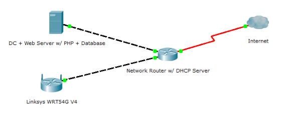

Short Description
===========

When implemented correctly, this allows one to implement a wireless network with a captive portal that authenticates end-users against an LDAP backend before permitting network access.  An alternative to 802.1x from a time when captive portals were more common.

Components
==========

Linux Server

 - Running Lighttpd + PHP + MySQL (captive portal)

Active Directory (or other LDAP enabled server)

 - User database to permit access to Wireless Network

Linux Powered Integrated Wireless Router or Access Point (ex. WRT54G)

 - Needs to be able to run PHP script locally and ebtables/iptables

Long Description
===========

WRTCaptivePortal is a legacy [WiFi captive portal](https://en.wikipedia.org/wiki/Captive_portal) implemented using a once very popular [Linksys WRT54G](https://en.wikipedia.org/wiki/Linksys_WRT54G_series) residential WiFi router running a third-party Linux firmware ([DD-WRT](https://dd-wrt.com/)).

Essentially the workflow provided by the resources in this repo are as follows:

1. WiFi Client (laptop, tablet, mobile phone, etc...) connects to the Open SSID being broadcast by the WRT54G
2. After opening a web browser and attempting to visit any non-HTTPS website, the user is redirected to a login page (the captive portal).  *Yes, this isn't as effective today due to prevalance of HTTPS by default, a problem that afflicted all captive portal systems of the past.*

    **How this works:**
    
    The WRT54G has an ebtables configuration that only allows DHCP to traverse between the new WiFi client and the rest of the network, it also actively redirects all HTTP traffic to a web server hosting the captive portal.
3. The user logs into the captive portal using credentials that are verified by the captive portal software against a backend LDAP source (ex. Active Directory)
4. After successful validation by the captive portal, an entry is made in a MySQL table with the WiFi clients MAC address
5. WRT54G's poll this MySQL table and update it's ebtables configuration accordingly permitting newly authenticatd MAC addresses
6. The user via their WiFI Client can now access the network and internet freely

Two parts of operational code are presented here.  One set (in the authServer directory) which runs the captive portal login page and authentication mechanism that runs against an LDAP (AD) server.  The second set of code (in the firewall directory) runs on a OpenWRT or DD-WRT enabled router.

Detailed Documentation
===========

[WRT54G-Captive-Portal-July-18-2010.pdf](WRT54G-Captive-Portal-July-18-2010.pdf)
